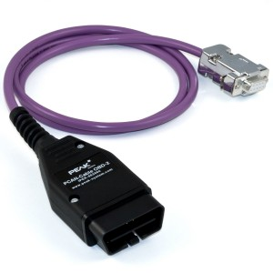
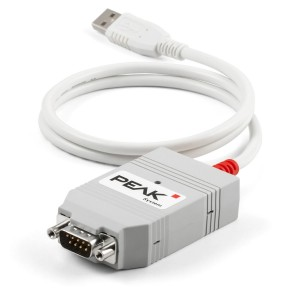
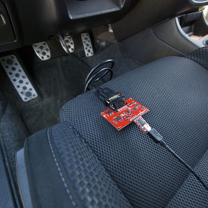

# CAN we talk Python?
[](https://travis-ci.org/shnewto/can-we-talk)
[](LICENSE)

_Talking to your vehicle over the CAN bus with Python_

## Overview

Superficially, the purpose of this Python 3 program is to provide examples to supplement the
talk titled _CAN we talk Python? Talking to your vehicle over the CAN bus with Python_, first
given at the PDX Python User Group in July of 2018.

The program itself however, actually does interesting things. When properly configured and connected
to your vehicle's OBD-II port, this program retrieves the following information from the vehicle:

* The specific OBD standard this vehicle conforms to
* The vehicle's current fuel tank level
* The time, in seconds, since the engine was powered on

Prerequisites for success:

* A vehicle powered on (motor on)
* A CAN connection to the OBD-II CAN bus from your computer

## Getting Started

### Linux Dependencies

* `python3` (`sudo apt install python3`)

### Windows Dependencies

* `python3` ([https://www.python.org/downloads/windows/](https://www.python.org/downloads/windows/))
* CAN driver ([Kvaser](https://www.kvaser.com/developer/canlib-sdk/), [PCAN](https://www.peak-system.com/PCAN-USB.199.0.html?&L=1), etc.)

### Python 3 Dependencies

* `pip3 install -r requirements.txt --user`

### CAN Hardware requirements

| OBD-II to DB9 Cable | CAN USB Adapter |
|---|---|
| [](https://gridconnect.com/obd2-cable.html) | [](https://gridconnect.com/can-usb.html) |

<!-- ### Alternatively...

| _Serial_ Diagnostics Kit |
|---|
| [](https://www.sparkfun.com/products/10769) | -->

## Usage

See the doc string in [can_we_talk.py](can_we_talk.py) or run `./can_we_talk.py -h` for usage
specifics.

### Usage Notes

#### Linux

On a Linux system `socketcan` is a default so `can_we_talk.py` can rely on the default settings
for `bustype` and `channel`. After initializing the socketcan interface with:

```bash
 sudo ip link set can0 type can bitrate 500000
 sudo ip link set up can0
```

you can run:

```bash
# Default Linux usage
./can_we_talk.py
```

#### Windows

On a Windows system `socketcan` is not available so the `bustype` and `channel` must be specified.

If you've installed the Kvaser SDK you need to run:

```bash
# Default Kvaser CANlib usage for Kia Soul Petrol
./can_we_talk.py -c 0 -b kvaser
```

Using PCAN drivers you can run:

```bash
# Default PEAK PCAN-USB usage for Kia Niro
./can_we_talk.py -c PCAN_USBBUS1 -b pcan
```

## Running the tests

You can run the tests with `pytest`, i.e. `python3 -m pytest --verbose`

## Further Reading

[OBD-II PIDs](https://en.wikipedia.org/wiki/OBD-II_PIDs)
